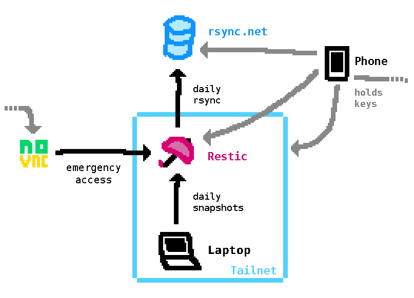

<script frontmatter>
title = "Restoring my file system with Btrfs, NixOS and Restic"
layout = "post"
abstract = "A while ago I accidentally broke the Btrfs installation on my laptop but thanks to some safety nets of the systems I had put in place I was able to restore everything within hours. This is a postmortem/analysis/account of that incident."
lastModified = new Date(Date.parse("2022-08-17"))
</script>

## The incident

This story starts fairly innocuous. I was working on some Nix code when I noticed that something was off with my filesystems. Every write failed with some variation of "read-only" error regardless of directory permission or subvolume options. Checking `/proc/mount` all of my mounted filesystems were indeed listed as `ro`.

```
$ cat /proc/mounts
[...]
/dev/dm-0 / btrfs ro,relatime,space_cache=v2,subvolid=265,subvol=/root 0 0
/dev/dm-0 /persist btrfs ro,relatime,space_cache=v2,subvolid=258,subvol=/persist 0 0
/dev/dm-0 /nix btrfs ro,relatime,space_cache=v2,subvolid=257,subvol=/nix 0 0
/dev/dm-0 /var/lib/swap btrfs ro,relatime,space_cache=v2,subvolid=259,subvol=/swap 0 0
[...]
```

I didn't think much of it yet. I had an idea what might have caused this and a reboot would just fix everything, or so I thought. So I had a quick look at my home directory, copied some files that seemed worth keeping onto a USB stick (you'll see why in a moment) and rebooted. And then I saw this:

{{#> figure}}
<video src="assets/failing-systemd-services.mp4" autoplay loop mute aria-description="systemd startup output with some failing units and a sad emoji next to it 😢"></video>

{{#*inline "caption"}}This is an approximation. The real output had more failing services.{{/inline}}
{{/figure}}

A large portion of unrelated systemd units was failing and the system wouldn't boot.

### Assessing the situation

Right, so at this point it's probably worth explaining my general filesystem layout, since it's kind of unusual. My laptop runs [NixOS](https://nixos.org) on a Btrfs filesystem that is (for the most part) wiped on boot. This is made possible by NixOS, which is able to start with just a boot partition and its own internal object store called the "Nix store". On my laptop, both are kept on separate partitions that are exempt from the automatic wipe. There are many great articles online describing such setups and I would especially recommend Graham Christensen's ["Erase Your Darlings"](https://grahamc.com/blog/erase-your-darlings) to get started. My partition layout in particular looks like this:

- **boot**
  - FS: FAT32
  - Size: 512MB
  - Mounted at `/boot`
- **meta**
  - FS: ext4
  - Size: 512MB
  - Not usually mounted
  - Holds a LUKS header backup of `crypt`
- **crypt**
  - FS: Btrfs in LUKS container
  - Size: Rest of disk
  - Root volume
    - Not mounted
  - Subvolume **/root**
    - Mounted at `/`
    - Reset on boot
  - Subvolume **/nix**
    - Mounted at `/nix`
    - Contains the Nix store
  - Subvolume **/persist**
    - Mounted at `/persist`
    - Contains all persistent data except for the Nix store
  - Subvolume **/swap**
    - Mounted at `/var/lib/swap`
    - Non-COW
    - Contains a swap file (primarily for hibernation)

As you can see, my home directory is not in there at all, so it's automatically part of the `/root` subvolume which is wiped on boot. Select folders within my home directory are actually bind mounts into the `/persist` directory, so I do keep state in my home directory but only when I've sorted it into my file hierarchy. I really like this approach because it gives me the ability to put temporary stuff in my home directory without having to worry about the cleanup but it does mean that I have to move files elsewhere to persist them. That's also why I've copied some files I was working on to a USB stick before.

Usually it's difficult to break something within this system by accident since I can just reboot and any stray config files are deleted. But in this case something larger was off. I initially presumed that something might have borked the Btrfs rollback that wipes the system from the initial ramdisk. So I fired up a the minimal NixOS installation disk (which I knew included `cryptsetup` and Btrfs) and mounted my filesystems. I attempted to perform the rollback manually but...

```
[root@nixos:~]# btrfs subvolume delete /mnt/root
Delete subvolume (no-commit): '/mnt/root'
ERROR: Could not destroy subvolume/snapshot: Read-only file system

[root@nixos:~]#
```

...somehow the filesystem was again mounted read-only? What? I was 100% sure I had mounted it without specifying `ro` and I also double-checked that none of the subvolumes had the `ro` property set. Turns out (after some googling) becoming read-only is a last defense mechanism of Btrfs when it encounters an installation that's so broken that it can't safely be modified anymore. Oh, great. Time to evaluate my options.

### My options

Now, I have to admit I panicked a little at this point. But in reality I probably had nothing to worry about because I was (kind of) prepared for this: I automatically upload almost all of the files in my `/persist` subvolume to a remote VM that runs a [Restic REST server](https://github.com/restic/rest-server) (and rsyncs its archives over to [rsync.net](https://rsync.net) as an additional layer of fuckup-protection) on a daily basis. The VM is only reachable over [Tailscale](https://tailscale.com) (including SSH) but that wouldn't have been an issue because all of the credentials required to provision a new host into my network were on my phone's password manager. Additionally the password manager stores all of the keys required to download and decrypt backup archives from the Restic server and in a pinch I could have accessed the VM using my hosting provider's noVNC console.



But all of that was slowwww and I didn't want to download roughly 55 gigabytes of data on a Sunday evening knowing my life depends on it. (Well okay, it didn't but it sure felt that way.) And besides I still had that dead filesystem body on my disk. There _had_ to be a way to get something useful out of that!

Many man page + Google roundtrips later I had come up with the following fool-proof™ three-layer plan:

- **Plan A**
  - Run a `btrfs check --repair`
  - Boot the system somewhat successfully
  - Diff everything against the last online backup archive and restore broken files
- **Plan B**
  - Get as much as possible out of the drive with `btrfs restore` (`-xmSiv` to preserve as much metadata as possible)
  - Reinstall NixOS and place the `/persist` files where they belong just before starting the installation
    - That would also include my OS configuration
  - Boot and diff everything against the last archive
- **Plan C**
  - Download the last archive using the credentials on my phone
  - Reinstall NixOS with the files in place

In my mind plan A would just magically work but I knew (from reading the man pages) `btrfs check --repair` would be a make-or-break operation so I ran the `restore` required for plan B first. I also copied my NixOS configuration and some keys to decrypt encrypted secrets from it as an additional layer of safety in case something went wrong with the password manager on my phone. (Although it would have been a bit of a hassle restoring my backup credentials that way.)

Just before hitting the big red ~~"Destroy"~~ "Repair" button I also tried a few last-minute suggestions I found online.

#### `btrfs rescue clear-uuid-tree`

...which didn't seem to do anything noticable.

#### `mount -o rw,updatebackuproot`

This one actually made the filesystem writable for a little while and I was able to perform that rollback I tried earlier. But no matter what I did, it went back to being read-only after a few seconds.

All in all, I have no idea if any of these actually helped or made things worse. Apologies to all Btrfs experts who are cringing right now, feel free to tell me what I should have done in an email.

### Plan A

Time to summon the forbidden one.

<video src="assets/repair.mp4" autoplay loop mute aria-description="btrfs check --repair being started. There is a menacing countdown below a warning which the recording zooms in on."></video>

So I let this thing run for quite a while. The output was pretty fast and dense but I couldn't tell if it was making any progress. My laptop did however turn into a cozy space heater. After about three or four hours I googled something along the lines of "how long does btrfs check repair usually take" and found this Reddit post:

{{#> blockquote-captioned cite="https://old.reddit.com/r/btrfs/comments/ibudb1/how_long_does_it_usually_take_to_rebuild_the/g20copr/"}}

{{#*inline "quote"}}
{{#> blockquote-para}}[It] does take quite a while, there were reports of it taking weeks for some people on the mailing list.{{/blockquote-para}}
{{/inline}}

{{#*inline "caption"}}
{{#> link href=cite rel="external nofollow noopener noreferrer"}}th1snda7 on Reddit{{/link}}
{{/inline}}

{{/blockquote-captioned}}

I killed the process and moved on to plan B.

### Plan B

Plan B turned out to be a lot less painful than I anticipated! Setting up my bespoke partition layout and preparing everything for the NixOS installer was fairly painless owing largely to the fact that I've completely automated it. (Because why install your OS manually and be done in 15 minutes when you can spend hours developing an automatic solution.) I did have to adapt the script a little bit though since it was written for NixOS 21.11 while this installation was going to be using version 22.05.

So I just ran the script which left me with an empty partition layout mounted in the running NixOS live system. I rsynced the restored files from my broken (and now completely obliterated) filesystem over (being careful not to overwrite some generated files that were important for the installation) and started `nixos-install`.

I was fully expecting the installation to fail and that I would have to do a more complicated two-step procedure where I first set up a minimal system and then bring in my whole config. But somewhat surprisingly my _entire 👏 desktop 👏 configuration 👏_ turned out to be reproducible from scratch. NixOS was designed to support exactly that so probably I shouldn't have been surprised but I'm normally used to software becoming "weird" and losing its guarantees when inputs grow in size and complexity. Three cheers for Nix!

Lastly I just had to verify that all of my files were restored correctly. Restic has a convenient `diff` command for comparing two archives, so I uploaded a new archive to the backup server which includes the necessary comparison and deduplication steps. The backup finished in just under five minutes (Restic is fast!), and all of the files seemed intact. The only differences were some changes that were not yet tracked in the previous archive and the "change" timestamp in (seemingly?) every file's inode metadata (which is distinct from the "modified" timestamp that's more prominently shown in user-facing output). A few manual checks also seemed to confirm that the files were intact.

## Aftermath

### What worked

A lot. This was totally unplanned and unexpected and all of the systems I've put in place worked as expected. Especially:

**NixOS** and my configuration turned out to be fully reproducible (well, probably not byte-for-byte but good enough). That is extremely cool. Full-system reproducability is an absolute super power when disaster strikes without the need to back up and shove around your entire system.

**Btrfs** is pretty much the hero of this story. If it hadn't been able to restore those files, I would have been in for a looong night of babysitting a 50 gigabyte download.

**Restic** (and my backup infrastructure in general) worked as intended when I needed it and allowed me to verify the integrity of the restored files. And did I mention it's fast?

### What could be improved

As mentioned before, all of the credentials required to access my backups were on my phone, so I was in theory always "safe". But that was also the only place (aside from the filesystem that broke in this incident) where that information was stored in a way in which I could access it. **If both my phone and my laptop were to be wiped or destroyed I would be unable to restore anything from my backup archives.** In fact, I came dangerously close to that: Just two days prior to this incident, I wiped and reinstalled my phone, meaning that it was temporarily without the data it usually holds. I do intend to print out all of the key- and password material required to restore files from my offsite backups _eventually_ to create a kind of "emergency folder" but so far I haven't gotten around to doing that (read: "been too lazy to...").

**Onsite backups.** Offsite is cool and important but I've really underestimated the usefulness of a local backup tier. I already had Btrfs snapshots on my laptop to recover from "oh no I shouldn't have done that" kind of mistakes but that doesn't work when you tear your filesystem to shreds. Although I'm not quite sure how to implement that yet. A dumb byte-for-byte mirror of the disk would be cool but

A) it's large and feels inelegant and  
B) it's less helpful in some cases - For example, it might be impossible to use the exact same disk image again if some important hardware component breaks and I have to replace it.

So file-level backups are probably still what I'll stick to.

**Integration tests** for my NixOS configurations to ensure that they're reproducible in terms of functionality. Currently, that's still a bit difficult because there's no way to customize the partition layout in NixOS test VMs and using the default layout would make the tests too detached from reality. But I [may be working on that](https://github.com/NixOS/nixpkgs/pull/178531).

Also, **check what the fuck you're running before you run it.** This one is self-explanatory.

---

By the way I actually still don't know what exactly caused that issue since I wasn't able to reproduce it in a VM, which is kinda spooky. But I have a pretty strong suspicion and no real reason to assume that it was caused by malware or anything bad like that.
